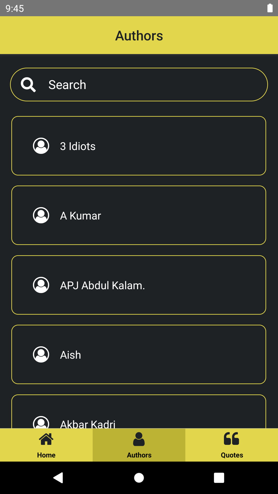
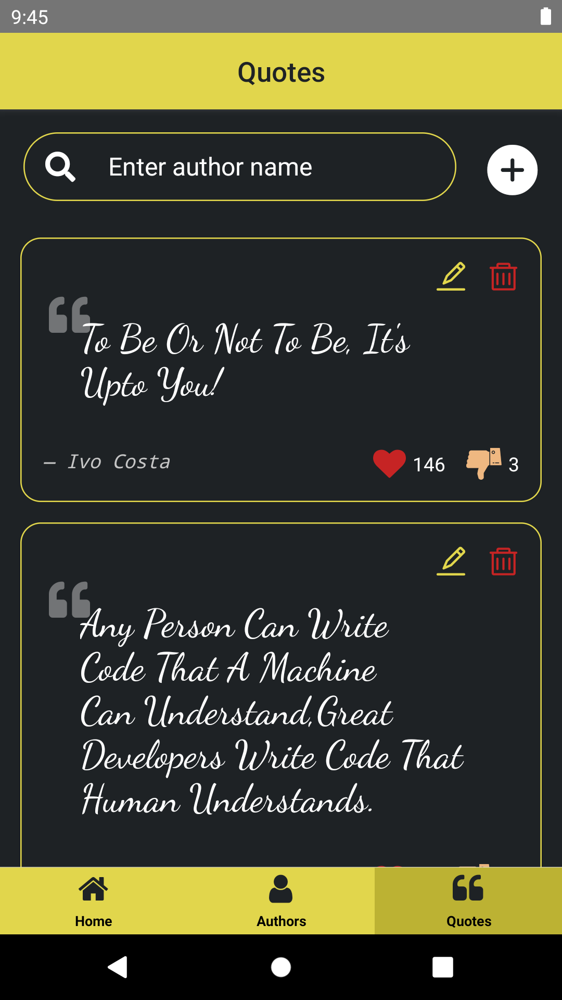
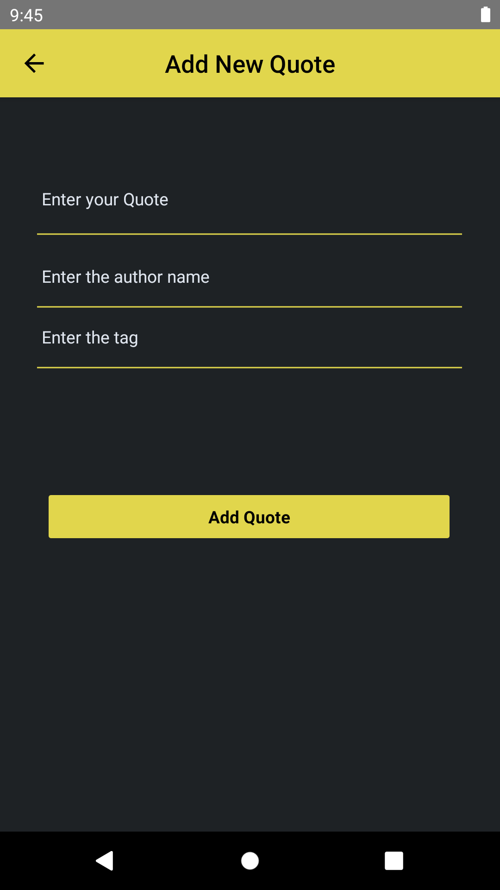
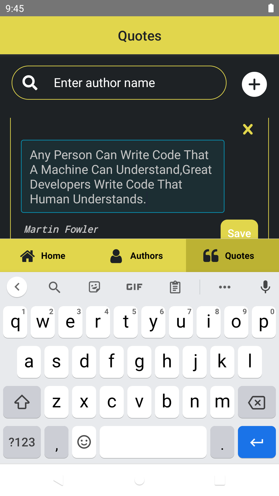

# React Native - Quotes App

### Let inspirational quotes motivate you and give you positivity every day!

**Quotes App** is full of motivational quotes. When you have difficult days, it has the power to heal you.
If you need an extra boost, it inspires you to fight for your goals and achieve them.
What’s more, we'll help you build positive habits, develop a positive mindset, and become a better you through daily inspirational quotes.

### Tech:

- React Native

## Installation

```
npm install
```

To make the pre-commit hook work, you need to run `npm install` when the project is already initialized as a Git repository.

Start the packager by running the following commands. Make sure you have Android emulator running before this.

### Run on Device

```
npx react-native run-android
```

You need to run `npx react-native run-android` to run on device or emulator

### Packages Used

- [wix/react-native-navigation](https://wix.github.io/react-native-navigation/docs/installing)
- [react-native-elements](https://reactnativeelements.com/docs/installation)
- [react-native-vector-icons](https://www.npmjs.com/package/react-native-vector-icons)
- [axios](https://www.npmjs.com/package/axios)

### ScreenShots - Quotes App

 





### Reference links:

For project setup please refer to the following README.md files:

- Installation of android studio and Project Setup [click here](https://github.com/CCI-CodeCrunch/app-quotes/blob/main/ReactNative/react-native-01/README.md)
- Setting up the Navigation [click here](https://github.com/CCI-CodeCrunch/app-quotes/blob/main/ReactNative/react-native-02/README.md)
- Add Icons in project [click here](https://github.com/CCI-CodeCrunch/app-quotes/blob/main/ReactNative/react-native-03/README.md)
